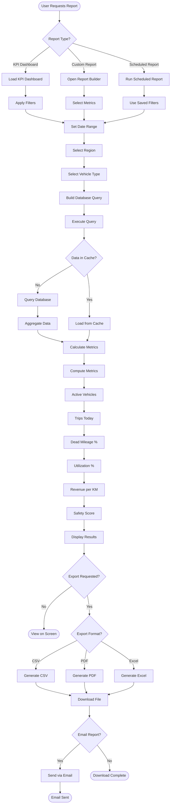

# FleetSync Workflow Flowcharts

## Overview

This document provides detailed flowcharts for all critical workflows in the FleetSync platform, covering every operational scenario and edge case.

---

## 1. RideSync Booking Workflow

### Complete Passenger Booking Flow


---

## 2. LogiSync Shipment Workflow

### Complete Freight Booking & Delivery Flow

```mermaid
flowchart TD
    Start([Shipper Logs In]) --> Dashboard[View Dashboard]
    Dashboard --> NewShip[Click "Book Truck"]
    NewShip --> Form[Fill Booking Form]
    
    Form --> LoadType{Load Type?}
    LoadType -->|LTL| LTL[Less Than Truckload]
    LoadType -->|FTL| FTL[Full Truckload]
    
    LTL --> Details
    FTL --> Details
    
    Details[Enter Load Details] --> TruckType[Select Truck Type]
    TruckType --> Flatbed{Truck Type}
    
    Flatbed -->|Flatbed| CheckFlat[Check Flatbed Availability]
    Flatbed -->|Reefer| CheckReef[Check Reefer Availability]
    Flatbed -->|Tanker| CheckTank[Check Tanker Availability]
    Flatbed -->|Box| CheckBox[Check Box Truck Availability]
    
    CheckFlat --> Available
    CheckReef --> Available
    CheckTank --> Available
    CheckBox --> Available
    
    Available{Trucks Available?} -->|Yes| ShowTrucks[Show Available Trucks]
    Available -->|No| Queue[Add to Queue]
    
    Queue --> NotifyLater[Notify When Available]
    NotifyLater --> End1([Wait for Availability])
    
    ShowTrucks --> CalcPrice[Calculate Pricing]
    CalcPrice --> Factors[Consider:<br/>Distance, Weight, Urgency, Truck Type]
    Factors --> ShowPrice[Display Price Quote]
    ShowPrice --> Confirm{Shipper Confirms?}
    
    Confirm -->|No| Form
    Confirm -->|Yes| CreateShip[Create Shipment Record]
    
    CreateShip --> WMSCheck{WMS Integration?}
    WMSCheck -->|Yes| SyncWMS[Sync with WMS]
    WMSCheck -->|No| SkipWMS[Skip WMS Sync]
    
    SyncWMS --> DockSched
    SkipWMS --> DockSched
    
    DockSched[Schedule Dock Door] --> AssignTruck[Assign Truck & Driver]
    AssignTruck --> NotifyDriver[Notify Driver]
    NotifyDriver --> DriverNav[Driver Navigates to Warehouse]
    DriverNav --> ArriveWH[Arrive at Warehouse]
    ArriveWH --> CheckIn[Check In at Dock]
    CheckIn --> Loading[Loading Process]
    
    Loading --> Scan{Barcode Scanning?}
    Scan -->|Yes| ScanItems[Scan All Items]
    Scan -->|No| ManualLog[Manual Logging]
    
    ScanItems --> Verify
    ManualLog --> Verify
    
    Verify[Verify Load] --> UpdateWMS[Update WMS Inventory]
    UpdateWMS --> Depart[Depart Warehouse]
    Depart --> Transit[In Transit]
    Transit --> Track[Real-Time Tracking]
    Track --> ArriveCustomer[Arrive at Customer]
    ArriveCustomer --> Unload[Unloading Process]
    Unload --> POD[Proof of Delivery]
    
    POD --> Photo[Take Photo]
    Photo --> Sign[Customer Signature]
    Sign --> DriverCOA[Driver Taps COA]
    DriverCOA --> UpdateStatus[Update Shipment Status]
    UpdateStatus --> Invoice[Generate Invoice]
    Invoice --> End([Shipment Complete])
```

---

## 3. COA & Auto-Assignment Workflow

### Complete on Arrival (COA) Automation


---

## 4. Driver Assignment Algorithm

### Smart Allocation Decision Tree


---

## 5. Alert Generation & Safety Workflow

### Safety Monitoring & Alert System


---

## 6. Warehouse Operations Workflow

### Dock Scheduling & WMS Integration


---

## 7. Analytics Report Generation

### KPI Calculation & Report Export



---

## 8. Emergency & SOS Workflow

### Passenger/Driver Emergency Response


---

## Edge Cases & Exception Handling

### Common Edge Cases Covered

1. **No Available Vehicles**
   - Queue booking
   - Notify when available
   - Suggest alternative times

2. **Driver Rejection Chain**
   - Try next 5 best matches
   - If all reject → manual assignment
   - Notify control center

3. **Payment Failures**
   - Retry 3 times
   - Offer alternative payment
   - Allow cash option

4. **Network Disconnection**
   - Queue actions locally
   - Sync when reconnected
   - Show offline indicator

5. **WMS Integration Failure**
   - Fallback to manual entry
   - Log error for retry
   - Alert warehouse manager

6. **Dock Congestion**
   - Dynamic rescheduling
   - Suggest alternative docks
   - Notify shipper of delay

7. **Driver Fatigue Override**
   - Require supervisor approval
   - Log override reason
   - Mandatory break after trip

8. **Simultaneous Bookings**
   - Optimistic locking
   - First-come-first-served
   - Notify second user

---

## Performance Optimization Flows

### Caching Strategy


### Load Balancing


---

## Summary

These flowcharts cover:
- ✅ RideSync complete booking flow
- ✅ LogiSync shipment workflow
- ✅ COA automation and auto-assignment
- ✅ Smart driver allocation algorithm
- ✅ Safety alert generation
- ✅ Warehouse operations and WMS integration
- ✅ Analytics and reporting
- ✅ Emergency SOS protocol
- ✅ Edge case handling
- ✅ Performance optimization

Every operational scenario is documented with decision points, error handling, and fallback mechanisms.
